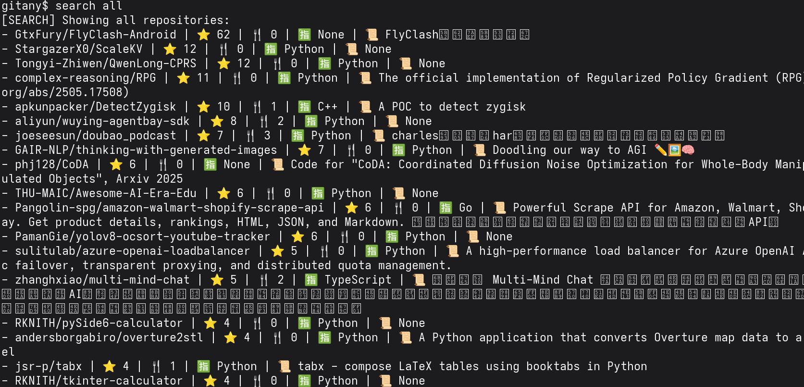

 
# GitAny - GitHub Project Search Tool Without Login

GitAny is a Python-based tool that allows you to search the latest GitHub projects of the day without logging in. It supports fuzzy search, conditional filtering, and visual analysis of repository data.

---

## Install Dependencies

```bash
$ pip install -r requirements.txt
```


---

## How to Launch

```bash
$ python gitany.py
```


---

## Command Overview

After launching, enter:

```bash
gitany$ help
```


To view all available commands.

---

## Data Update

Fetch data from GitHub (supports proxy settings and custom page count):

```bash
gitany$ update
[+] Proxy IP (default: none): 192.168.0.113  
[+] Proxy Port (default: none): 7890  
[+] Number of pages to update: 2
```


---

## Search Syntax Reference

| Command Format        | Description                                  |
| --------------------- | -------------------------------------------- |
| search dec=<keyword>  | Fuzzy search by repository description       |
| search lan=<keyword>  | Fuzzy search by programming language         |
| search repo=<keyword> | Fuzzy search by repository name (full\_name) |
| search star>=500      | Filter by star count (supports > >= < <= =)  |
| search fork<=1000     | Filter by fork count (supports > >= < <= =)  |
| search all            | Display all repository data                  |

Example:

```bash
gitany$ search dec=gpt
gitany$ search all
```




---

## Data Visualization

Enter the following command to generate charts and save them as image files:

```bash
gitany$ graphy
```


 


Includes:

* Bar chart: shows star and fork count per repository
* Pie chart: shows distribution of programming languages
 